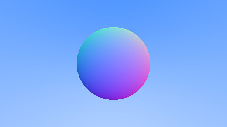
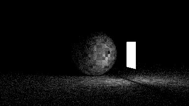
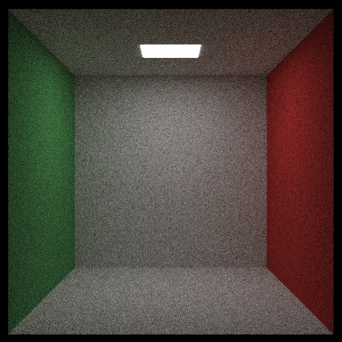
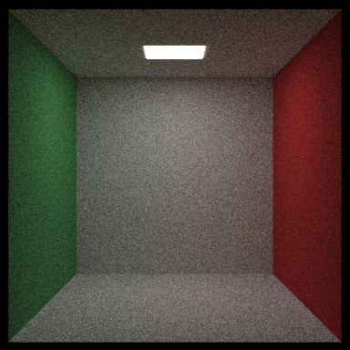
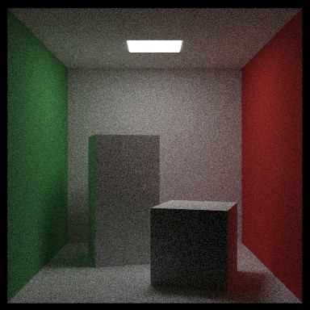

# rtiow - Ray Tracing in One Weekend

  
Rust port of RTIOW by Peter Shirley, v3.1.2, 2020-06-03  
https://raytracing.github.io/

Completed books are tagged as a release.

- [x] - *Ray Tracing in One Weekend*
- [ ] - *The Next Week*
- [ ] - *The Rest of Your Life*

### Table of Contents
1. [*Ray Tracing in One Weekend*](#oneweekend)
2. [*The Next Week*](#nextweek)
3. [*The Rest of Your Life*](#restofyourlife)

### Notes

I believe I've stayed close to the spirit of the book. I added multi-threading
with `rayon` for the last render of the first book. All renders after that were
multi-threaded.

<a name="oneweekend"></a>
## *Ray Tracing in One Weekend*

A primitive command line interface exists, scenes and threading need to be
adjusted by recompiling. Each flag is optional. It defaults to 100 samples and
384 pixel width, height will be calculated with an aspect ratio of 16:9 if not
specified. Arbitrary aspect ratios are supported.

```
cargo run --release -- [filename.ppm] [samples] [width] [height]
```

All images were done with 100 samples and 50 bounces.

Creating a blue to white background gradient  
  
Placing the first sphere in the scene  
  
Showing the normals of the sphere's surface  
  
Adding a ground plane with another large sphere  
  
Multiple samples per pixel, anti-aliasing  
  
The first diffuse material  
  
Gamma correcting the linear light  
  
Improving the scattering calculation  
  
The first Lambert material  
  
Adding metallic materials  
  
First pass of dielectric materials, light is only reflected  
  
Added the chance for refraction to occur  
  
Placed another sphere inside the dielectric to make a glass bubble effect  
  
Added a Snell's law correction  
  
Added camera controls to adjust the field of view  
  
Adjusting FOV for zooming out  
  
Zooming in with another FOV adjustment  
  
Depth of field blur is added  
  
Final scene as on the cover of the book, with some personal touches added  
  


<a name="nextweek"></a>
## *The Next Week*

All images are 100 samples unless otherwise noted. With BVH and multi-threading,
sample count can be increased dramatically and still finish in a very tolerable
time.

I was better about saving the scenes in this, grouping the camera with it.
However, due to the nature of the book, enough incremental churn occurs that
it's not convenient to keep every camera, world, and rendering combination
pictured here.

I made an enum for the Perlin noise to allow for selection over the several
types made over the course of the chapter: trilinear, unfiltered,
net/camouflage, smooth, and marble.

<a name="chapter2"></a>
**Chapter 2:** Bouncing Spheres, simulating motion blur  
  
<a name="chapter4"></a>
**Chapter 4:** Added a checker texture to the ground,
implemented bounding volume hierarchies for massive render speedup in some
scenes, 400 samples  
  
Two checker spheres  
  
<a name="chapter5"></a>
**Chapter 5:** Hashed Perlin noise  
  
Playing with the previous scene, added motion blur to one sphere  
  
<a name="5.2"></a>
**5.2:** Perlin noise with trilinear interpolation.  
  
<a name="5.3"></a>
**5.3:** Trilinear filtering with cubic Hermite  
  
<a name="5.4"></a>
**5.4:** High frequency scaling for the noise, this is a scale of 20  
  
The book example seems to be a frequency of 4, determined through trial and
error  
  
<a name="5.5"></a>
**5.5** Perlin noise with random unit vectors on lattice points  
  
<a name="5.6"></a>
**5.6** Substituting turbulence in for the noise function, not the intended
result as in the book  
  
Multiplying turbulence directly by the color as illustrated in the book  
  
<a name="5.7"></a>
**5.7** Adjusting the phase of turbulence, making a marble texture  
  
<a name="chapter6"></a>
**Chapter 6:** Using images as textures  
  
<a name="chapter7"></a>
**Chapter 7:** Turning objects into lights, small rectangle light  
  
Adding a sphere to the scene, 1000 samples  
  
<a name="7.6"></a>
Noisy, empty Cornell box. Aspect ratio changed to 1:1. My result doesn't look
like the Cornell box in the book which is very shadowy  
  
Added flipped face material for less noise with Aarect planes. There doesn't
seem to be much a difference, I'm not sure where the discrepancy lies  
  
Cornell box, now with blocks but not rotated, 1000 samples  
  
Standard Cornell box scene with rotated boxes, 1000 samples  
  
Cornell with blocks of smoke, 1000 samples  
  


<a name="restofyourlife"></a>
## *The Rest of Your Life*
