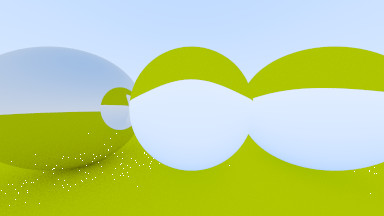

# rtiow - Ray Tracing in One Weekend

  
Rust port of RTIOW by Peter Shirley, v3.1.2, 2020-06-03  
https://raytracing.github.io/

Completed books are tagged as a release.

- [x] - *Ray Tracing in One Weekend*
- [ ] - *The Next Week*
- [ ] - *The Rest of Your Life*

### Table of Contents
1. [*Ray Tracing in One Weekend*](#oneweekend)
2. [*The Next Week*](#nextweek)
3. [*The Rest of Your Life*](#restofyourlife)

### Notes

I've stayed close to the book so far. I may make changes to make my life easier,
including changing the architecture to suit the language or using `rayon`.

<a name="oneweekend"></a>
## *Ray Tracing in One Weekend*

A primitive command line interface exists, scenes and threading need to be adjusted by recompiling. Each flag is optional. It defaults to 100 samples and
384 pixel width, height will be calculated with an aspect ratio of 16:9 if not
specified. Arbitrary aspect ratios are supported.

```
cargo run --release -- [filename.ppm] [samples] [width] [height]
```

All images were done with 100 samples and 50 bounces.

Creating a blue to white background gradient  
  
Placing the first sphere in the scene  
  
Showing the normals of the sphere's surface  
  
Adding a ground plane with another large sphere  
  
Multiple samples per pixel, anti-aliasing  
  
The first diffuse material  
  
Gamma correcting the linear light  
  
Improving the scattering calculation  
  
The first Lambert material  
  
Adding metallic materials  
  
First pass of dielectric materials, light is only reflected  
  
Added the chance for refraction to occur  
  
Placed another sphere inside the dielectric to make a glass bubble effect  
  
Added a Snell's law correction  
  
Added camera controls to adjust the field of view  
  
Adjusting FOV for zooming out  
  
Zooming in with another FOV adjustment  
  
Depth of field blur is added  
  
Final scene as on the cover of the book, with some personal touches added  
  


<a name="nextweek"></a>
## *The Next Week*

Chapter 2: Bouncing Spheres, simulating motion blur  
  


<a name="restofyourlife"></a>
## *The Rest of Your Life*
